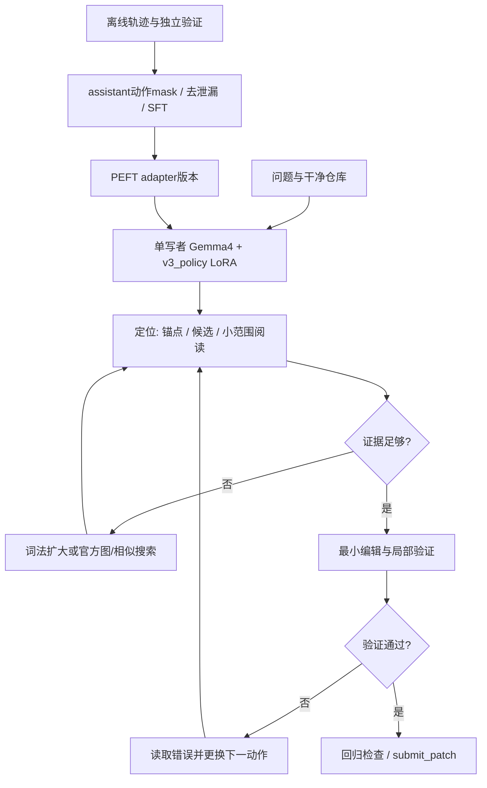

建议 V3 首轮训练一个共享的、文本层 `q_proj/o_proj` rank 16 LoRA，监督定位决策、官方工具调用、补丁与验证、失败后的下一步恢复。主路线从比赛指定 W4A16 checkpoint 解量化出冻结 BF16 基座，保持原量化权重作为最终推理基座；通过短轨迹 SFT 和四臂消融检验收益。首轮不做在线 RL，不训练新检索器，也不堆多 adapter。单 A100 不是训练成功的证据：先用 2k 序列核验梯度、内存和原官方权重上的 adapter 效果，超限才转 NF4 QLoRA。

这是可审阅设计 v1.0，2026-10-05，供 KAGGLE-19 的 Mika 整合。配置与预算都是提案；本轮 GPU 使用 0，未训练、批量生产数据、读取 V2 留出内容、修改共享代码或正式提交。方案设计已获 KAGGLE-20 具体授权，V3 中旧“不训练”背景不再适用；V2 冻结基线、D/H、候选及资源安排保持独立。

## 1. 事实、假设与待验证事项

| 类型 | 当前结论 | 证据与边界 |
|---|---|---|
| 已核实的项目输入 | V1 官方分数 0.06，没有已知逐题失分归因；V2 结果尚未交付 | 已验收 [V2 方案](https://multica.ai/api/attachments/01a10b44-7548-71a8-826b-d0e31d4b89b1/download)。分数不能换算成 8/129，也不能据此确定是定位或模型能力失败 |
| 已核实的比赛约束快照 | 指定 `gemma-4-31b-it-qat-w4a16-ct`；声明式 YAML；PEFT adapter 经 `adapter:` 挂载；总解压大小 <3 GiB，rank≤128，最多8个；gemma4 tool/reasoning parser，32768 总窗口；正式4×L4/TP4 | KAGGLE-9 2026-10-04核查及2026-10-05 [官方摘录](https://multica.ai/api/attachments/01a10b23-be66-7325-a225-dd36e521c38d/download)。属于复用的一手核查记录，本轮没有重新查询全部 Kaggle 规则 |
| 用户规划前提 | 单A100-80GB、4核、16GB主机RAM、单作业4h、账号1GPU；V3不得占V2资源 | KAGGLE-20 当前描述；不是本轮连接或资源实测。所有107操作交 Liang 运行时 |
| 本轮独立核实 | 官方三个checkpoint revision、小型配置；原31B与W4A16的chat template文件SHA相同 | 2026-10-05匿名只读HF API及官方raw文件，见第3节与 `V3-contract-and-evidence.json`；未下载权重 |
| 有依据的收益假设 | 训练“看证据→选下一动作→错误后换策略”可能减少无效工具轮次、改善修复 | SWE-Gym提供轨迹训练机制证据；不是本赛或Gemma4收益实测。必须与冻结模型同harness配对 |
| 待验证 | CT解量化+Gemma4+PEFT梯度；W4A16+非零adapter加载；训练mask；官方实际resolver revision及软件版本；长上下文稳定性 | 下游T0/T1检查点，不能用上游库main支持替代比赛运行时证据 |

旧LoRA KV问题只保留为风险：KAGGLE-9记载host承认问题并称有workaround，未取得当前上线证据。本轮不把它当禁令，也不声称已修复。单A100能验证功能和迁移实验，不能验收4×L4的KV容量结论。

## 2. 目标选择与模型/agent联合架构

训练对象是**证据条件下的下一动作策略**，不是背诵仓库补丁。优先级：定位与上下文选择 → 工具语法及退出 → 小补丁与验证 → 失败恢复。补丁生成约占监督token的30%，因此不止训练工具格式。SFT主目标是加权的assistant token交叉熵；定位gold只用于训练标签和隔离评测，不进入agent输入。

| 方向 | 依据、预期收益 | 成本提案与最小实验 | 验收、失败与下一步 |
|---|---|---|---|
| 主线：多任务SFT行为克隆 | 适配工具交互接口、输出短且可执行的动作；SWE-Gym支持训练轨迹可改善agent的机制 | 200–400个合格决策窗口，0.4–0.8M输入token目标；训练≤2 GPU-h，包含于4h试训作业 | dev在官方W4A16上工具有效率不下降，下一动作成功率增加或浪费工具减少；只有train loss下降则不放大，检查mask/基座迁移/数据噪声 |
| 主线内：失败恢复SFT | 成功轨迹往往缺“搜索为空/测试失败/编辑失配”后的策略；训练正确后继动作而非模仿失败 | 25%监督token；首轮dev另分恢复场景，若有信号再做同token预算“去掉恢复数据”的4h扩展臂 | 恢复成功率目标+10pp或重复无信息动作下降≥25%；样本中的错误动作必须mask。若只有变长、无成功增益，减少恢复配比并审查标签 |
| 扩展：执行验证筛选/rejection SFT | 以真实回归/任务测试筛好轨迹，训练仍是SFT，无需同时驻留参考模型 | 首轮只使用已验证轨迹；额外生成64任务×最多2次×4min = ≤8.53 GPU-h，加setup/验证，提议另批12h上限 | 成功与失败轨迹均按固定分母记录；成功样本不足不复制成伪数据，停止扩容或改课程/任务来源 |
| 扩展：离线DPO | 同一状态的成功/失败或同成功更省预算配对，解决SFT只学“常见动作”的限制 | ≥200个合格对才启动，beta候选{0.05,0.1}、lr{5e-6,1e-5}，每次最多2h训练，首批≤4h；参考logprob离线顺序计算，另计预算 | dev偏好准确率目标≥65%、主resolved不退化；无执行结果的“喜欢/不喜欢”不入库；错误负例/长度偏差则回退SFT |
| 后备：在线验证奖励优化 | SWE-RL等提供学习信号机制，但不是本赛资源下已证实路径 | 仅提出G=2的8任务验证rollout探针：≤64min模型生成，加测试/setup；完整RL预算暂不授权或虚估 | 环境重复验证一致率≥95%、奖励可区分、梯度/serving可顺序切换后再测每轮成本。稀疏奖励全0、测试可被投机、16GB RAM撑不住则停止 |

奖励扩展的硬要求：奖励使用独立环境中任务测试与回归测试，不用patch字符串相似度作最终成功；改测试、删测试或伪造“pass”不给正奖励。两个都成功时才能用更少token/工具作为偏好；超时和基础设施错误单列，不伪装成语义负例。SWE-RL原研究使用演化数据及相似度等规则奖励，不能直接移植其数值收益。

首选单写者直接调用官方工具，减少跨agent上下文复制和错误转述；这是V3新拓扑提案，不依赖V1的强制analyzer。B、L、S、LS四臂必须使用**同一V3单写者骨架、同一预算和采样**，只切adapter与搜索策略。V1包可单独作参考，不能混入四臂而把拓扑变化算LoRA收益。若保留独立只读分析员，则先作为另一个拓扑因素评审，不与首轮训练臂混用。

部署映射：YAML中的LlmAgent、instruction、sampling、官方9工具和`adapter: v3_policy`足以表达第一版。定位状态是模型在会话中的约定与工具返回，**不是已经实现的强制状态机**。KAGGLE-22交付搜索算法后冻结具体策略；涉及额外索引/脚本必须先通过官方skill和compiler验证，本方案不预设自定义Python入口、额外serving模型、外部API或硬控制hook。LoRA不授予新工具权限。无预算计时字段时采用官方`get_status`返回和预先约定调用步数，不能给训练样本提供评分端私有remaining-time信号。

## 3. 基座选择、量化差异与版本契约

| 用途 | 官方HF ID与本轮API revision | 选择与边界 |
|---|---|---|
| **首选训练源与最终推理源** | `google/gemma-4-31B-it-qat-w4a16-ct` @ `52f3f65bc7a02d555763bc923bd1d9094898219d`，最后修改2026-07-20 | 训练用CT `dequantize=True`得到BF16、冻结源权重；最终推理仍加载原W4A16+adapter。解量化还原量化值，不还原量化前浮点权重 |
| 降级研究源 | `google/gemma-4-31B-it` @ `842da3794eaa0b77d5f08bae87a17459d91ff475` | 非QAT浮点IT权重，可SFT/QLoRA；形状一致不代表行为/分布相同。首选解量化路径不可用才登记新试验，不静默替换 |
| 不默认选用 | `google/gemma-4-31B-it-qat-q4_0-unquantized` @ `1e4d8beecacb8b7590c1d8bedd7335f687bf311f` | 模型卡称其为Q4_0 QAT浮点checkpoint；不能假定它就是W4A16 CT的量化前权重。需明确谱系/张量证据，否则没有比“同形不同基座”更强的迁移保证 |

这些是公开HF revision，**不是已获取的比赛评分器实际revision**。下游软件准备须记录resolver最终HF ID、commit和实际权重文件SHA；不一致则重新核对兼容，不能改adapter_config中的路径冒充同源。

W4A16 CT配置：pack-quantized、4-bit对称整数、group_size=32、BF16激活，视觉投影/塔和lm_head在ignore清单；NF4+double quant是另一种量化，**不能对已压缩CT直接再传bnb配置声称是同一个模型**。优先CT解量化BF16+LoRA，使训练源对应最终量化权重的解码值。Transformers文档明确提供加载时解量化并fine-tune的通用路径，但Gemma4组合仍须测试。

NF4后备路线：用首选源流式解量化、写临时分片BF16，再流式加载bnb NF4冻结基座训练；CT解量化本身失败时可另批原IT源路径。后备每次登记`source_revision / dequantized_artifact_sha / nf4_config_sha`，不可覆盖BF16试验。它节约内存但多一次量化误差；最终仍在**原官方CT**上评测adapter，不能上传自制整模型替换官方权重。LoftQ/bnb支持不能直接证明官方CT迁移质量。

核心几何已核对：60层、hidden=5376、MLP=21504、vocab=262144；50个局部层head_dim=256、32Q/16KV，10个全局层head_dim=512、32Q/4KV、K=V，sliding_window=1024。Transformers公开源码在全局K=V层不建立独立v_proj；首轮避开K/V降低映射复杂度。下游仍须在**锁定版本**枚举真实modules及shape，不凭本稿数字强行改库。

初始target regex：`^model\.language_model\.layers\.\d+\.self_attn\.(q_proj|o_proj)$`，预期120个模块。PEFT加前缀后另登记实际keys。若class装载成text-only使前缀变成`model.layers`，这是待确认的导出映射变化，不靠改字符串直接“修好”；优先使用Gemma4ForConditionalGeneration官方结构、冻结视觉塔/投影、embedding/lm_head/norm，只输入文本。

rank16预计参数：`16 × [50 × 2 × (5376+8192) + 10 × 2 × (5376+16384)] = 28,672,000`；BF16导出权重约54.69MiB，FP32约109.38MiB；参数/梯度/Adam两矩按合计16bytes估算约0.427GiB。这只计算q/o LoRA，不包括冻结权重与激活。alpha32，缩放alpha/r=2；bias=none，modules_to_save为空，普通LoRA、非DoRA/rsLoRA，初始A随机/B零。rank候选{8,16,32}，首轮16；没有最优值结论。扩展加文本MLP rank16额外77,414,400参数，q/o+MLP共106,086,400、BF16约202.34MiB；先证明小adapter有效才尝试。

artifact manifest至少包含：schema、source HF revision与逐分片SHA、config/tokenizer/template SHA、真实module name/shape清单、r/alpha/dtype、训练数据/split/family/exclusion SHA、训练配置及代码SHA、完整依赖lock+CUDA/driver、seed、optimizer/global_step/消费token、adapter文件SHA、served model revision、parser/compiler/evaluator版本及smoke证据。训练checkpoint的base_model路径保持真实来源；部署配置若需路径别名，仅记录显式转换和source provenance，不掩盖迁移。

导出只存adapter两文件，清理未被引用的历史adapter目录以免自动发现；总包字节数重新审计。FP32训练参数转BF16导出是独立精度变化，须在相同基座的短fixture比较工具解析与动作，失败则保留FP32 adapter（约109.38MiB仍远低于3GiB），不得以体积为由接受功能退化。PEFT额外字段是否被官方版本接受须由compile/load检查，不能上传本稿draft替代真正的adapter_config。

## 4. 训练样本接口、模板与loss mask

KAGGLE-21拥有题库来源/权限、split及独立评测；KAGGLE-22拥有搜索状态和候选字段，Mika通过父任务一次性对齐。这里提出接口需求，不重派这两个任务。V2 D/H均不用于V3训练或调参：独立评测负责人维护排除清单，训练端只接收通过交集检查的V3 manifest和“0交集”证明，无需暴露V2 H文本/标签。

| 字段组 | 必须提供 |
|---|---|
| 身份/权限 | sample_id、task_id、repo、base_commit、family_id、时间、split、source URI/revision、代码/数据许可证与允许训练状态、snapshot/env/tool_schema SHA |
| 状态/观察 | system/user/tool messages，原生tool_calls结构、tool_call_id对应关系、实际工具输出及截断标记，候选文件/符号/行号/证据、候选来源；只能包含agent当时可见信息 |
| 决策标签 | task_type=`localize/tool/patch_verify/recover`；完整assistant动作；label provenance；loss span及权重；bad action为context-only；需要恢复的错误类型 |
| 验证 | 基线相关测试失败与gold修复后通过、回归结果、命令/exit码/超时分类、环境digest、patch applies、执行日志SHA，验证者与时间；未验证或flaky不作成功监督 |
| 隔离监督 | gold位置/训练gold patch/任务测试与反例保留在label/evaluator域，绝不放进prompt；未来提交日志、完成后patch、隐藏评测信息不能进入早期搜索状态 |

混合比例以**有loss的assistant token**计：定位30%、工具及退出15%、补丁/验证30%、失败恢复25%。每family设上限且至少覆盖3类真实环境错误；合成变异≤40%，必须标记合成并在可执行环境验证。先按仓库→问题/PR家族→时间划分，再生成/窗口化；不能先把轨迹切段随机split。课程先单文件/稳定测试，再多文件依赖，最后恢复与误导候选。许可未闭合、训练与dev/test相交、测试无法复现即拒收，不为凑配比复制样本。教师默认用许可可得的Gemma4或已有合格轨迹；付费/受限教师不作前提，公开教师轨迹仍需独立许可与接口适配。

每个训练窗口：原问题+当时可见且有证据的短状态摘要+最近1–3次工具观察→下一完整assistant动作；输入+输出初始≤2048token。摘要不能包含gold或未来发现；在轨迹真实经过的工具结果上产生，保留构建规则/哈希。优先短动作训练而非一次喂完32k轨迹。不能从JSON字符串/patch/函数调用中间截断；超长则按完整turn与代码hunk切分或隔离，**恢复观察和正确后继动作必须同时留在窗口**。第一个assistant输出前的内容是prompt，tool响应一律mask。

模板：使用首选模型同revision的GemmaTokenizer和canonical chat_template，所有tool arguments保持结构化object。本轮原IT与CT模板SHA均为 `ae53464bf3be25802b3a5b37def7fd89667067d7577049b3b2d74c4d8de4c6d4`；CT tokenizer_config SHA为 `b8045a4576903e86903291d5cbdd4adfc8859e9ce3c98621bdbd957f73ed394b`，完整tokenizer词表仍须下游下载并锁定。模板对工具返回的前向扫描和连续assistant turn有特殊处理，不能套Gemma3模板、ChatML或手拼JSON到content。

训练format采用Gemma4原生tool/turn标记，但不添加新token或改embedding。PAD=0/BOS=2；配置EOS含1与106，tokenizer文本EOS是`<eos>`。下游以真实tokenizer+gemma4 parser核验工具闭合/assistant结束，不能把所有动作简单补一个EOS；模板会处理不同turn边界。首轮沿用冻结V3对照的thinking配置，不作为独立训练因素。原生可见reasoning若来源许可且质量验收通过可保留为context，首轮不对其长文本施加loss；不让标签编造“教师思维”。agent可见动作和终止token才监督。

**显式构造labels为主**：system/user/tool/padding及失败动作=`-100`；assistant工具名、参数、完整编辑片段、短计划/定位和合法结束标记计loss。窗口只监督目标后继动作，历史assistant作为context mask。按token偏移映射而不是搜索某段字符串决定mask，去掉无有效label窗口。可加Jinja generation区间用于求mask，但要求渲染文本逐字节等于官方模板。当前官方模板无generation区间，本轮已静态核对；不能仅设`assistant_only_loss=True`就假定生效。TRL文档也要求generation区间。训练输出与prompt分离时completion mask需排除嵌入的tool响应。

验证至少20个合成fixture，覆盖空搜索、多tool_call、失败恢复、thinking开关、tool返回内包含标记文本、Unicode路径/引号；断言system/tool loss数=0、bad action loss数=0、target动作loss数>0、BOS恰当且无重复、工具参数roundtrip无损、未知工具0、训练与serving渲染一致。mask失败停止试训，不用loss下降掩盖问题。

## 5. 配置草案与资源账

随附 `V3-train-config.draft.json` 是设计配置，不是已通过验证的训练脚本。首轮：BF16冻结官方CT解量化基座，LoRA trainable参数FP32、AdamW FP32 moments，batch1/accum8、seq2048、lr5e-5、warmup=10%（首轮至少1步）、cosine、weight_decay0、beta0.9/0.999、eps1e-8、grad_clip1、dropout0.05、seed17。普通LoRA，不改norm/embedding。lr仅探索{2e-5,5e-5,1e-4}；先看稳定性与dev信号，一次最多追加2个预注册候选，不能做全网格。不开CPU offload、不FSDP/DeepSpeed、不并行generation服务、不启用torch.compile；梯度checkpointing、use_cache=False、显式单GPUdevice placement，dataloader workers=0、dataset流式/预分词磁盘分片，packing=False。attention后端首选支持混合注意力/softcap的SDPA；锁定版本若回退eager必须测峰值，不默认FA2支持head_dim512且正确处理Gemma4全部语义。

| 项目 | BF16首选估算 | NF4后备估算/处理 |
|---|---|---|
| 冻结参数 | 官方原31B API BF16参数31,273,088,876×2=62,546,177,752 B≈58.25GiB；是dense参考值，CT解量化后需实测；embedding tying失效可能增加约2.625GiB | 准确值需枚举：主体4bit+未量化embedding/视觉/输出及scale，约20–28GiB规划区间；不能只按31B×0.5算15.5GB |
| adapter训练状态 | q/o r16约0.43GiB；建议预留0.6GiB | 同量级；prepare_model_for_kbit_training可能把未量化权重转FP32，计入上行估算并实测 |
| 激活/临时buffer | checkpointing+2k seq先留6–12GiB；CUDA/attention workspace/碎片2–4GiB；总约67–75GiB，**不是可装下保证** | 2k–4k保留8–20GiB激活/临时，总约30–52GiB；误差取决后端与loss实现 |
| vocabulary logits | 2k×262144的BF16 logits已是1GiB，FP32=2GiB；4k FP32=4GiB，尚未加CE临时张量 | 使用已验证的按token分块CE并保持softcap/shift/mask数学；不能靠label mask假定全logits不分配 |
| 主机RAM | 整个BF16 CPU state_dict要≈58GiB，禁止；逐tensor/shard+meta init直接GPU，进程RSS目标≤12GiB，系统留4GiB | bnb装载仍须流式；不得把整个解量化checkpoint放CPU；optimizer/数据/worker无大规模CPU缓存 |
| 磁盘/下载 | CT公开卡约20GB级参考、实际以文件manifest为准；若直接GPU解量化无需整份BF16副本；准备至少80GiB可用盘作源/日志/依赖/小ckpt提案 | 若生成BF16中间副本另加约63GB，建议总可用盘150GiB；未验证107磁盘，不自动下载 |

分块loss优先选锁定TRL版本支持的chunked_nll，或保持softcap一致的等价实现；用≤128token小fixture对照未分块loss/梯度，容差预登记fp32相对1e-4、BF16相对1e-2。不兼容时先seq1024、后NF4，不能不经验证替换Gemma4输出逻辑。完整lm_head不训练但反传到hidden state仍须保留，不能误用no_grad造成adapter无梯度。

**硬门槛**：seq2048 smoke测到峰值GPU allocated或reserved任一>72GiB，或RSS>12GiB，不扩大序列/训练规模；先seq1024重测一次，再按登记路线转QLoRA。未知可用显存取`min(72GiB,实测空闲容量−4GiB)`作上限。基座常驻已过门槛则直接停止BF16路线。r16下若只有少量q/o梯度，需证明非零梯度/参数更新不是“参数requires_grad=True”即可。OOM最多一次有依据的降级，不循环重启试错。

QLoRA需`load_in_4bit=True, nf4, double_quant=True, compute_dtype=bf16`，只在合法BF16来源上量化，kbit准备后重新核对冻结/FP32模块和tie关系，LoRA modules仍只限文本q/o；禁止all-linear意外覆盖视觉投影。NF4质量失败不宣判LoRA无用，优先检查重新量化漂移；BF16路径也失败才升级为compatibility blocker。

依赖：训练软件与比赛推理软件分别锁定，不能为了训练升级正式评分器。候选起点为PyTorch2.10.0、Transformers5.17.0、PEFT0.21.0（来源页面给出可用稳定版本线索，**本轮未安装验证**）；TRL及compressed-tensors必须锁定提供上述API/行为的具体release或commit及wheel SHA，现为待填。公开文档main功能不保证这些候选版本全具备，T0不能通过时允许最多一次记录明确的版本修复，再仍失败就交阻断。完整freeze/源码SHA、GPU驱动和实际官方包版本是开训前产物，未填字段使runner fail-closed，不能自动安装latest。

## 6. 4h断点续训与最小预算

所有GPU预算待Mika批准，且由Liang确认避开V2时段；本轮不申请作业。试训排期按以下独立检查点，每个≤4h且账号至多一个GPU任务。加载、导出、验证均计入作业壁钟；不能把最后15min之外的收尾变成后台任务。

| 阶段 | 拟上限 | 交付与停止条件 |
|---|---|---|
| T0 CPU接口准备 | 2–4人时，0 GPU-h | 依赖lock、字段/mask fixture、120模块shape清单构建方法、source/download/disk计划、split交集证据；缺权限/可执行数据/具体软件lock不进入训练 |
| T1 最小试训 | **1个4h作业**：0–60min解量化/装载/shape/12更新smoke；60–180min小SFT；180–225mincheckpoint重载和官方CT adapter测试；225–240min保存 | 训练含smoke合计≤2h。上限32 optimizer updates、8 accumulation、2k长度理论最多524,288输入token；若达2h先停，即便不足32步也报实际曝光量。0–60min兼容步骤失败不挤占无上限训练 |
| T2 最小四臂dev | **另1个4h作业**：D3-dev12×4臂×单seed=48次×最多4min=192min生成上界，约30min分批装载，18min保存；setup/独立validation不保证能塞进余量 | 在相同harness骨架下B/L/S/LS；若预算预测不足，开跑前缩为8任务×4臂=32次并声明降配，不按结果挑删题。到3h45m统一停止未运行任务记not_run，已跑失败保留分母，不宣称矩阵完成 |
| T3 扩容门槛后 | 提议新增≤8h训练、≤12h轨迹生产分别审批；独立H3-test目标32家族×4臂×2seed=256次，约17.07h生成上界+装载/setup/validation，**不含在8h试验预算** | H3费用需以T2实測重算并另批；每4h分片，adapter/harness SHA固定，结果出来后不调同H3。两次seed不当64个独立家族 |

T1+T2的8GPU-h是**已有合格种子轨迹之后**的最小试训/消融上限，不包含未知的数据生产费用。若KAGGLE-21没有现成合格轨迹，最低数据探针提议32任务×最多2次×4min=4.27GPU-h生成上界，另留装载/回放/验证，总上限6GPU-h（两个≤4h作业），因此冷启动提案合计≤14GPU-h，仍不能保证成功样本足够。CPU种子环境构建/测试按4核串行预算目标≤8壁钟h，数据接口实现另需约1–2人日；超过即报告缺口，不以“生成不耗训练GPU”隐藏成本。若合格窗口/独立family不足，T1只能工程smoke，暂停泛化试验；题库最终规模与预算由KAGGLE-21/Mika对齐。较大64任务生产的12h提案不再叠加最低32任务探针已生成的同样工作，按增量计账。

T1的12更新smoke可在8个合成/许可fixture上循环，用以证明实现能更新/过拟合；此为工程检查，不能充当泛化证据。若开销不足以32步，按实际完成报告，曝光少于16步或200k输入token时T2只作可行性探针，不据无增益否定训练。热身后记录输入/supervised tokens每秒、step时间及RSS/显存峰值，用`剩余输入token / 实测tokens/s + eval + checkpoint + load`预测；预测过4h则缩曝光，不承诺固定规模4h跑完。比较吞吐必须同时报输入和监督token口径。

checkpoint每10 optimizer updates或15min（谁先到），在完整optimizer步后保存：adapter safetensors、optimizer/scheduler、Python/NumPy/torch CPU/CUDA RNG、sampler顺序及cursor、global_step、已消费输入/监督token、梯度accum边界、source/data/config/code/依赖SHA；内部optimizer状态可以pt，**不进提交包**。保留最近2个完整checkpoint和按dev规则选出的1个候选；写临时目录→校验→原子标记complete。3h45m主动保存并退出，SIGTERM只尽力触发同一回调，不依赖抢救。

断点续训不是重新加载adapter再起一个新optimizer。下个4h作业必须重建同revision基座、恢复全部状态并拒绝哈希不一致；在8样本fixture先对照不间断与断点两步的loss/参数差异。中断发生于accum中途则回滚最近完整步，最多损失一个accum窗口且日志注明；数据游标和RNG不可只恢复其一。主机RAM已受限，保存只收集adapter与其optimizer，不保存整模型或FP32主权重。

## 7. 兼容性分层验收与收益判定

兼容是三层，各层单独出证据：

1. **结构/实现**：120个target匹配、r16 shape正确、冻结基座不更新、20mask fixtures通过；12个优化更新有非零梯度且loss有限；checkpoint恢复正确。零初始化adapter用于实现对照，本轮未产出adapter。
2. **官方推理基座功能**：卸载trainer后启动原W4A16、gemma4 parser；zero adapter与base、非零trained adapter三种请求，先短2k再4k，各2次；0未知tool/格式错误/NaN/挂起，保存route和实际model ID。zero/base数学等价允许浮点差异；采用同一组固定prefix的下一token贪心/可用logprob检查，预登记top1一致率≥99%作为漂移警报，若接口不暴露该信号则记录unavailable并采用同fixture工具动作一致性，不能编造logit一致证据；性能不同不能推算资源不同。非零adapter在8个train fixture上达到≥7/8目标动作/格式且参数delta明确；不成功则检查mapping、mask与量化迁移，不扩大训练。A100检查通过仍不代表4×L4已通过；后续L4长8k/16k档各2请求核查KV/超时，32k不默认可用。
3. **真实agent泛化**：配对四臂实际工具→patch→独立validation。B=冻结W4A16+原搜索S0；L=同S0+LoRA；S=冻结W4A16+新搜索S1；LS=同S1+LoRA。同source/tokenizer/parser、snapshot、timeout/token预算、随机seed、温度与上下文压缩；以family_id分组，顺序按预注册哈希平衡，干净会话不共享补丁、缓存或上臂定位答案。

候选冻结前D3-train/dev/test必须在仓库/家族/时间层隔离（具体来源配额由KAGGLE-21定）；D3-dev可复用调参，但永远不叫test。oracle定位仅作不运行agent的误差分析或另标oracle诊断臂，不混进四臂分数。并报候选Recall@5/10、首次正确源码阅读耗时、执行有效tool call率、重复无信息动作率、恢复成功率、最终resolved（主指标）、input/output/supervised token、GPU及主机峰值、Phase1生成与Phase2验证时间、解析/超时/基础设施错误。gold改动位置只是代理标签，其他正确修复位置可存在，不能凭不等于gold文件直接判错。

**D3-dev放大门槛提案**：在12家族上L−B或LS−S净增≥2个resolved，并在训练重点行为上有同向改进；或resolved不减且median生成时长降低≥15%、p90不增加>10%、错误类型不恶化，作为效率候选。定位Recall@5+10pp、重复无信息动作−25%是中介指标，均不是已获得成绩。只有S改善、L不改善则继续搜索实现，训练检查/修订保持独立，不把LS−B全归LoRA。交互项`(LS−S)−(L−B)`单列，12家族结果是投资判断不是统计显著证据。

**独立H3判定**：在冻结32家族×2重复上，报告按家族聚类的配对置信区间和discordant counts；主质量候选以LoRA增量resolved的95%下界>0作为“提分已证实”标准。区间跨0则证据不足，不许改题后称新test；效率候选需resolved非劣性下界≥−5pp且时长改善≥15%（当前样本可能无法支持，不能放宽解释）。Mika可决定追加新家族预算或停止，正式提交仍需具体版本确认，不用每天LB代替这套因果测试。

统一停止：泄漏/许可失败、来源revision未知、mask错、基座被更新、adapter被忽略、长请求挂起、内存超过门槛、训练loss NaN、dev退化≥2家族且无补偿时即停相应路线。基础设施错误不靠删题掩盖，修复后版本化重跑相关pair；不会把训练失败归因于模型无能力。最多一个兼容修复与一个有理由的内存降级，仍失败即交精确阻断、日志及下一条可批准路线。

## 8. 交叉审查、接口对齐与下游任务包

稳健顾问既有 [基线/评测意见](https://multica.ai/api/attachments/01a10b11-6471-7bf4-9ee2-f903bb359b76/download) 的最强论点：analyzer独立上下文能处理模糊问题，但收益必须经同条件配对、官方真实工具链与独立留出验证，不能以提示或mock通过当证据。我接受这点，把“训练短动作能提分”降为假设，加入B/L/S/LS、独立验证和家族隔离；同时挑战“只有每题强制双agent才可靠”的隐含前提，V3把动作策略学进单写者，是否更好由数据决定。

另一条最强批评是只有129条官方公开题且既有V2 D/H需要保留，不能全题训练后用同题宣布有效。我据此放弃“直接吃完公开patch”的路线，使用另审的外部许可任务/可执行变异+独立V3 split，排除V2全部D/H家族。模糊任务的独立上下文收益若T2仍明显，则下轮另审读者分支，而不是为立场争论。

本轮读取KAGGLE-21和KAGGLE-22的评论扫描均未见已交付V3文档，不能虚构与其本轮达成共识；KAGGLE-19已要求Mika在三份交付后进行一次交叉审查。待整合的具体接口争点：恢复标签可验证性、每family上限、V3实际split规模、搜索候选字段是否可由官方工具生成、单写者/保留读者的可部署路径。已有稳健观点已准确纳入；当前V3接口是否一致由父任务验收。

| 下游任务包提案（不在本轮派工） | 输入/交付 | 验收与责任边界 |
|---|---|---|
| 数据接口/小种子 | KAGGLE-21产物→V3 schema、200–400窗口、licenses/split/exclusions/hash、验证日志 | 数据专职实现；无需向训练者提供V2H内容；父任务确认比例及来源，0交集/执行成功/失败恢复mask |
| 搜索接口/官方适配 | KAGGLE-22产物→S0/S1契约、候选/证据字段、YAML/skill可表达性表 | 搜索专职实现；无新入口；两策略可在同agent骨架切换，明确软约束与硬控制 |
| T0训练实现 | 本稿+draft→源锁定、stream load、regex/mask、分块loss、adapter-only续训、依赖lock | 训练专职实现；CPU fixture证据、无整模型CPU驻留；不能默认latest、不能因configs存在视作开训授权 |
| T1试训与导出 | T0/data验收+Mika具体预算→4h日志、实际曝光/峰值/吞吐、adapter与manifest、重载结果 | 仅Liang运行时申请/运行107；V2无冲突；所有步骤在前台收齐；失败按门槛停止 |
| T2/H3隔离评测 | 固定四臂、adapter/harness/source SHA、预注册协议→逐题结果及因果差值 | 独立评测实现；不向训练者泄露H3；A100/L4证据分开；验证费用入预算 |

设计验收需要上述可执行规格与明确未知项，不要求本轮取得训练成绩。本稿建议Mika先审批T0、确定接口及T1/T2预算，再组织下游；不新建任务、不触发已分配的两个研究助手。

## 9. 一手来源与适用边界

公开资料访问日期均为2026-10-05；模型revision与文件hash另见证据JSON。资料日期不明的网页以访问日标示，不能将“latest/main”当比赛锁定版本。

- [官方W4A16模型卡](https://huggingface.co/google/gemma-4-31B-it-qat-w4a16-ct)、[固定revision配置](https://huggingface.co/google/gemma-4-31B-it-qat-w4a16-ct/blob/52f3f65bc7a02d555763bc923bd1d9094898219d/config.json)：量化格式/几何，不提供本赛adapter实测保证。原浮点和Q4_0来源见第3节HF IDs及证据JSON。
- [Transformers compressed-tensors](https://huggingface.co/docs/transformers/main/en/quantization/compressed_tensors)：加载时解量化通用API、dense执行与PEFT训练支持；实际Gemma4/具体release待T0。此证据让“同官方量化值训练”成为优先路线，而不是猜测Q4_0谱系。
- [Transformers Gemma4源码](https://github.com/huggingface/transformers/blob/main/src/transformers/models/gemma4/modeling_gemma4.py)：混合注意力和全局K=V/v_proj缺省；只用于设计推断，最终模块枚举在锁定版本。
- [vLLM Gemma4源码](https://github.com/vllm-project/vllm/blob/main/vllm/model_executor/models/gemma4.py)、[vLLM LoRA说明](https://docs.vllm.ai/en/latest/examples/features/lora/)：HF/vLLM名字映射、packed modules和量化LoRA机制；main不是比赛部署代码，不能据此宣布旧bug已修。
- [TRL SFT文档](https://huggingface.co/docs/trl/main/en/sft_trainer)：assistant mask依赖generation区间、分块loss及PEFT集成；版本功能要实测。[HF Gemma4 tool SFT例](https://huggingface.co/docs/google-cloud/en/examples/vertex-ai-notebooks-fine-tune-gemma-4)实际训练E2B，不能外推31B A100内存/速度；本方案不创建其云资源。
- [PEFT量化指南](https://huggingface.co/docs/peft/main/en/developer_guides/quantization)、[QLoRA，2023-05](https://arxiv.org/abs/2305.14314)：NF4/kbit方法；不证明与官方CT等价，不借65B论文配置承诺本机速度。
- [SWE-Gym，2024-12，修订2025-06](https://arxiv.org/abs/2412.21139)：可执行软件环境/轨迹训练机制；模型、工具、预算不同，不引用论文提分作为本赛目标值，数据使用仍要逐来源许可审查。
- [DPO，2023-05](https://arxiv.org/abs/2305.18290)、[SWE-RL，2025-02，修订2025-12](https://arxiv.org/abs/2502.18449)：偏好与规则奖励扩展依据；不证实本赛训练必要性或训练收益，需本稿消融证伪。

未触碰V2留出、比赛任务内容或gold，也未传播凭据。附件仅为本任务原创方案、配置与公开模型小型元数据汇总；无代码变更，不需要PR。
