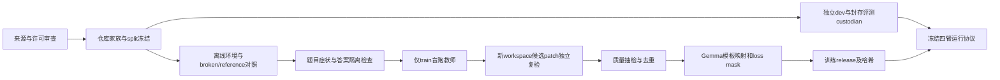

建议采用“可执行题库 → 盲跑教师轨迹 → 独立复验 → LoRA SFT → 模型×搜索四臂消融”的 V3 主线。先做 8 题生产试点；通过后才扩为 96 个独立问题家族（训练64 / 开发16 / 封存测试16）。训练既覆盖定位和工具调用，也覆盖补丁、测试反馈与失败恢复。公开比赛题库暂不进入训练，V2 的 D/H、配置和预算全部保持独立。

本稿为 KAGGLE-21 的可评审设计 v1.0，日期 2026-10-05；下游实施前由 Mika 与 KAGGLE-20/22 对齐。数字均为提议规模、预算或门槛，未发生数据生产、训练或效果实验；96 题不是已经收集的题库。附件 `V3-synthetic-schema-example.json` 是手写的虚构结构示例，既非真实任务也非实测轨迹，禁止导入训练。

## 1. 证据与事实边界

| 类别 | 本稿采用内容 | 边界与证据 |
|---|---|---|
| 已核实的任务授权 | V3 必须后训练、LoRA，优化搜索；设计先行，下游执行，107 只交 Liang 运行时 | KAGGLE-13 用户评论 `01a10b6c-84ca-7171-aee7-885762bdf3ab`；KAGGLE-19/21 当前描述。覆盖 V3 旧“不训练”背景，不改 V2 |
| 已有官方核查 | 声明式提交；允许 adapters、受控 skill 脚本；指定 `gemma-4-31b-it-qat-w4a16-ct`；评分环境无网络，提交解包 <3GiB | KAGGLE-9 评论 `01a10833-a21b-7340-b891-23a5719b99b4`，2026-10-04核查。这里复用已有核查，不声称本轮再次验证评分环境 |
| 已有规则核查 | 禁止把官方验证/测试人工标注或预测用于提交；外部数据/工具受比赛合理可得性约束 | 同上；不能从“公开代码”推断比赛许可，亦不据外部工具条款直接判校内硬件违规 |
| 已有数据核查 | 官方129条公开任务涉及 fastapi/rich/requests/httpx；历史核查称带 patch/test_patch | 这是来源盘点，非榜单分母。本轮未取得实际 tasks/snapshots；公开 gold 存在不等于可作训练监督 |
| 已验收 V2 | B0 ZIP SHA256 `93cb223e79ecb610ba281e507f7833811b879718708b749feff77d05247256bb`；D8/H24 的规则已定，实际 manifest 当时尚未生成 | [V2已验收方案](https://multica.ai/api/attachments/01a10b44-7548-71a8-826b-d0e31d4b89b1/download)，本轮经CLI下载，原文SHA见交付索引。V2效果结果未见交付，不假设其已提分 |
| 已有软件来源 | 官方starter指向Kaggle模型v2；HF候选revision `52f3f65bc7a02d555763bc923bd1d9094898219d`；compiler/evaluator/parser入口已定位 | [F2来源核查](https://multica.ai/api/attachments/01a10b46-8d66-73e3-bfa3-877283fa7a89/download)。两源字节等价、实际wheel哈希及LoRA运行兼容均待执行核验 |
| 本轮增量事实 | 8个候选仓库根许可证正文可公开读取；SWE-smith代码MIT，提供可执行任务生产机制 | 第3节链接，访问日2026-10-05。尚未取得固定commit的仓库内容、PR清单和环境闭包 |
| 给定资源前提 | 单A100-80GB / 4核 / 16GB主机RAM / 单作业4h / 全账号1GPU | 用户给定规划前提，不再连接排查，不写作本轮实测；V3须排在V2已安排占用之外 |
| 待验证假设 | 成功与恢复轨迹能让Gemma更快定位、减少无效调用并提高解决率；合成题可迁移到真实修复 | 只以冻结的真实任务与变异任务分项消融验证，不引用其他模型成绩当本赛收益 |

旧LoRA KV问题仍是兼容性待测项，不能自动否决LoRA；新搜索是否能用声明式拓扑/skill表达由KAGGLE-22确认。没有运行证据时分别标记“未执行”，不能标为通过或失败。

## 2. 要训练的行为与最小假设

建议一个多任务 SFT 数据接口，首轮不以纯问答或长篇解释替代真实动作：

| 能力 | 监督单位与证据 | 预期收益 | 最小验证与失败分支 |
|---|---|---|---|
| 定位 | 问题+实际搜索/读文件观测 → 下一检索动作或有源码证据的候选路径/符号/行范围 | 提高file/symbol recall，缩短首次可信定位时间 | 同一搜索固定，比较adapter开/关；只记路径但不读源码、真实题召回不增则不扩数据 |
| 工具调用 | Gemma模板中的assistant工具调用，参数符合真实工具schema | 降低解析错、重复命令和越界输出 | parser回放+真实服务工具回环；工具名/参数不兼容立即停训数据发布 |
| 修复与验证 | 实际源码+定位依据 → 编辑动作；真实测试观测 → 最小修正/结束 | 提高干净环境的完整修复率 | 评估新环境候选patch的F2P/P2P，不能用模型“完成”文字充当成功 |
| 失败恢复 | 真实失败前缀作条件 → 受监督的正确恢复后缀 | 错误定位、空搜索、测试失败后有证据地换路径 | 恢复样本单独消融，若增加无效循环/超时则移除其权重并保留原LoRA主线 |

课程用训练集的预定义复杂度推进：C1 单文件、明确行为锚点、短轨迹；C2 无文件锚点或需要符号定位；C3 2–3文件依赖与一次测试反馈恢复。首轮按训练token约40%/40%/20%抽样；每题总权重归一，单仓库不超过训练有效token的30%。难度由预注册字段（文件数、依赖跨度、症状锚点、所需测试层次）决定，不能拿测试集的模型失分重新选题。比例是待测超参数，由KAGGLE-20最终冻结。

训练必须保留LoRA路线；若全量生产吞吐不够，先在合格训练子集试训并报告规模，不用prompt替代训练承诺。SFT先于偏好/RL：失败动作只作context，不当正向目标；偏好对暂存但首轮不启用DPO/GRPO，避免多轮验证奖励成本掩盖基础数据问题。

## 3. 来源、访问与许可清单

选8个与官方4仓库不同的候选仓库，减少V2污染并支持整仓库封存。以下角色是预分配建议，不是已冻结split；正式选题必须以实际权限、固定commit许可证和可执行性审查闭合。若项目同源、fork、共享vendored代码或同一个修复被跨仓库移植，合并成仓库家族，不能凭名称不同声称独立。

| 候选及建议角色 | 本轮根许可证观察 | 可生产任务方向 | 执行前所需核验 |
|---|---|---|---|
| pallets/click，训练 | [BSD-3-Clause正文](https://raw.githubusercontent.com/pallets/click/main/LICENSE.txt) | CLI参数、边界值、错误处理；真实修复+变异 | 固定commit与NOTICE、测试闭包；Pallets同源项目并组 |
| more-itertools/more-itertools，训练 | [MIT正文](https://raw.githubusercontent.com/more-itertools/more-itertools/master/LICENSE) | 迭代器耗尽、边界、顺序；真实修复+变异 | 避免复制标准教材函数问答，执行序列行为测试 |
| pytest-dev/pluggy，训练 | [MIT正文](https://raw.githubusercontent.com/pytest-dev/pluggy/main/LICENSE) | hook分派、参数匹配、异常传播 | pytest同源问题/移植家族不能跨split |
| mahmoud/boltons，训练 | [BSD-3-Clause正文](https://raw.githubusercontent.com/mahmoud/boltons/master/LICENSE) | 容器、迭代、类型边界 | 各模块版权/第三方来源与完整测试环境 |
| python-attrs/attrs，开发 | [MIT正文](https://raw.githubusercontent.com/python-attrs/attrs/main/LICENSE) | 属性转换、验证、继承 | attrs/cattrs共享或移植代码并组；不用于教师训练 |
| dateutil/dateutil，开发 | [BSD与Apache正文及适用说明](https://raw.githubusercontent.com/dateutil/dateutil/master/LICENSE) | 日期边界、时区、解析异常 | 逐文件许可、时区数据许可；时间/locale固定 |
| pypa/packaging，封存测试 | [双许可入口](https://raw.githubusercontent.com/pypa/packaging/main/LICENSE)：Apache或BSD | 版本比较、specifier、marker | 下载所选commit的LICENSE.APACHE/BSD正文，记录采用路径 |
| marshmallow-code/marshmallow，封存测试 | [MIT正文](https://raw.githubusercontent.com/marshmallow-code/marshmallow/dev/LICENSE) | 序列化/校验、嵌套schema、未知字段 | dev仅为当前查询分支，必须固定commit；字段级测试与依赖锁 |

这些链接仅支持根许可证观察。保留版权与许可声明，额外记录fixtures、vendor、测试数据和依赖各自许可。仓库代码许可不自动覆盖issue评论、外部图片、所有作者附件或第三方教师输出。真实任务首选已合并可复现修复的代码/测试，问题描述由本项目依据行为和执行复现重新撰写；原issue仅留URL/日期/来源ID，原文纳入须独立许可证据。GitHub文档明确区分public访问与许可：[Licensing a repository](https://docs.github.com/en/repositories/managing-your-repositorys-settings-and-features/customizing-your-repository/licensing-a-repository)。

生产方法候选：复用[SWE-smith代码](https://github.com/SWE-bench/SWE-smith)的环境→变异→测试杀伤→问题描述思路，其[代码许可证MIT](https://github.com/SWE-bench/SWE-smith/blob/main/LICENSE)。官方仓库说明开发/测试平台为Linux+Docker，不在本Windows运行数据生产。现成[SWE-smith数据卡](https://huggingface.co/datasets/SWE-bench/SWE-smith)声明MIT，但聚合卡不能替代逐样本源仓库许可；该卡也建议语言专用版本。首轮不下载庞大合集/镜像库，不沿用其已有轨迹而跳过工具映射、去重和复验。论文/代码方法可借鉴，不承诺复现其其他基座的成绩。

明确排除：V2全部D/H及其问题/修复家族；官方验证/隐藏测试；来历不明dump、付费教师默认额度、无许可网页、受限私有仓库、未获所有者授权的真实工作数据。暂将官方fastapi/rich/requests/httpx全仓库家族加入V3训练与开发denylist；实际V2 manifest可只交独立custodian核查，不转交作者。此保守方案允许在V2 manifest尚未完成时继续新仓库设计。

## 4. 三种生产来源与验收

**真实历史修复**：采集候选merged PR的父commit/补丁/测试，确认不是只改文档、仅更新依赖或混合巨大重构；锁定父commit，移除答案线索，独立复现行为。已合并PR本身不是正确性证据。源问题描述按可观察症状撰写，不能逐句翻译补丁说明并泄漏文件/行号。用户原issue已有文件/traceback可按原信息保留，并标注anchor来源。

**确定变异**：在已通过选定回归测试的固定源码上，单个可追溯变异（条件边界、参数转发、容器顺序、异常处理等）产生broken tree。要求语法有效、目标测试稳定失败、原clean tree通过；逆变异作为reference repair，独立测试用于防“猜逆操作”。不注入`BUG`标记，不修改源码文件名暴露答案；语法损坏任务首轮占比≤10%，避免只学语法修补。

**合成行为任务**：独立给出规格与确定测试；可以做API契约变异，但不以教师自评的“合理”替代测试oracle。用holding-out边界、性质测试或不同实现的差分测试增强验证；reference patch与oracle不能由同一次生成无复审地互相证明。

每题至少三次干净对照（各2次执行）：broken+验收测试应有≥1个稳定F2P失败；reference+同验收测试应全部通过；原clean/reference对P2P回归全部通过。无失败目标、原环境本来失败、reference不通过或两次不一致，进入quarantine而非成功集。无现成可靠测试的真实修复不进入首轮，只记录候选与缺项。

源码snapshot给actor时没有future git history、gold patch、私有test_patch、参考修复摘要、生成器日志及泄漏答案的路径。已有公开repo tests允许运行；用于验收的新增heldout tests独立保存，运行actor阶段不装载。任务级oracle可比训练期可见tests更强。

## 5. 数据结构与存储权限

不是把全部字段拼成一份训练JSONL。按能力分隔四个数据面；所有发布均带schema版本、访问scope与派生血缘：

| 数据面 | 最少字段（省略表示非法，不是自动默认） | 访问边界 |
|---|---|---|
| `task.public` | task_id、origin_kind、repo_url/repo_family、base_commit、source_time、problem_statement、statement_sha256、snapshot_sha256、env_id、public_test_commands、split、problem_family_id、difficulty、parent_ids | 训练actor仅train；开发actor仅当次dev题；评测actor仅当次封存题。生产许可审查者可读来源元数据 |
| `task.audit` | source URLs/PR IDs、原文件sha、license SPDX+原文sha+NOTICE、授权范围/主体、acquired_at、transforms、generator revision+seed、lineage、dedup证据、排除/不确定原因、review者与时间 | 数据custodian与审查者，封存split记录不发给训练/搜索作者 |
| `oracle.private` | gold_patch blob/hash、test_patch blob/hash、F2P/P2P IDs、验证命令、timeout、expected行为、gold_files、gold_symbols、acceptable_locations、validator_version、所有对照stdout/stderr/JUnit/exit/duration/hash | train可用于受控生成监督；dev仅evaluator验收；封存测试仅独立evaluator。训练作者不读dev/test gold |
| `trajectory` | trace_id/task_id、teacher来源/版本/template/parser/工具schema、seed、是否看gold、逐步messages/actions/observations、before/after tree_sha、elapsed/token、候选patch_sha、verification_ref、failure_labels、review_status、loss_mask_ref | train通过filter后进入export；dev/test轨迹封存，结果仅预注册汇总；受限raw logs不作公开附件 |

`env.lock`必须包含OS/arch、容器digest或等价rootfs hash、Python与测试runner版本、精确wheel/dependency hashes、安装命令、locale/TZ、环境变量allowlist、网络策略、CPU/RAM、时间/随机种子、测试选集和超时、snapshot内容树hash。不是仅`pip freeze`。宿主GPU服务的模型/tokenizer/template/parser/wheel/hash/实际flags放`run.protocol`，不混入任务测试环境。只允许Linux离线可回放闭包；在4核16GB上CPU环境验证并发1，不启动模型时先验证gold。

逐动作字段：`step, role, phase(localize/edit/validate/recover/finish), tool_name, arguments, observation_ref, observation_sha256, exit_code, started_at, duration_ms, input_tree_sha256, output_tree_sha256, finish_reason, loss_eligible`。真正工具名和参数从官方compiler注册表/工具schema导出，由KAGGLE-22给映射；不得把研究框架专用动作原样当Gemma工具调用。观测大blob按内容寻址落盘，训练时仅用实际发生过的确定裁剪视图，同时保存原文hash与裁剪配置。

`verification.status`枚举`pass / fail / invalid_env / inconclusive / not_run`；成功须F2P全通过、P2P无回归、未篡改验收工具/测试，且两次新鲜workspace复验。禁止`not_run`填resolved=true。`release_state=design_only / candidate / quarantine / released`；本附件例子固定design_only，sha空值明确表示未取得。生产released必须全部引用可解析、hash非空匹配、许可approved、split冻结、复验pass，不接受示例字符串作ID/哈希。

## 6. Gold、教师与损失mask

普通教师轨迹默认blind：看到问题、broken tree和允许的工具，不能看到gold/test_patch。先采样后由独立oracle验收；不提供持久的验收细节让教师反复针对hidden tests调到过拟合。

对**train split**允许一个分离的gold-assisted路线，gold可帮助构造定位标签或修复示范，但必须标`teacher.gold_access=true`、保存介入点，不能称“自主解决”。gold辅助叙述不能进入actor消息；可导出真实检索/读文件上下文与正确下一动作，但上下文不得倒推伪造命令输出。首轮目标gold辅助样本≤20%有效训练token，和blind样本分项审计；若blind成功率低，扩大辅助比例须重新冻结数据配方，不能暗中填满成功轨迹配额。

教师优先顺序：①指定Gemma基座本地拒绝采样，记录实际revision与采样；②获得许可的既有公开轨迹，逐条工具映射+源码/补丁复验后才能用；③明确获批的开源教师（模型许可、资源与托管条款另审）；④付费/闭源教师不纳入默认预算。题目草稿可通过确定模板从复现症状生成，避免额外教师调用；若用LLM，记录model/provider/terms/date/成本且只用于train。

训练export对system、user、tool observations、padding全部mask=-100；只监督assistant可执行tool call、经过验证的编辑和有证据的结束动作。内部reasoning/thoughts默认不监督，也不生成事后长篇思维链。恢复轨迹把失败assistant动作mask=-100，保留其真实观测作条件，正确恢复后的assistant动作才进入loss。只失败且无正确后缀的轨迹进入诊断池或未来偏好对，不进入正向SFT。mask按token跨度并以实际Gemma模板+tokenizer验证边界；`include_thoughts`可见性不等于训练应学习其文本。

建议训练窗口先以4k tokenizer tokens为接口设计上限，实际长度由KAGGLE-20 profile冻结。长轨迹按完整工具回环分窗：保留当步问题、源码读取依据和必要失败反馈，任何动作不得看到未来结果；不截断函数调用JSON/工具角色边界，不让patch输出前缀与结尾跨非法窗口。4k是训练切窗初值，不改官方32k推理上限。若KAGGLE-20选2k或更长窗口，export_config升版本并复验。最多保留2条成功轨迹/题用于选择，正式最小集每题1条；恢复视图可以派生但不增加独立题数。

## 7. 生产与验证流水线

1. **ingest**：最小下载选中源码/小型metadata，按许可证台账登记；repo_url+commit核验可取得，权限不明停止该源。
2. **group/split**：先按第8节分组，冻结训练/开发/封存角色；隔离数据custodian，公开许可证检查不暴露封存问题正文。
3. **env_build**：CPU串行构建离线wheel闭包与环境锁；选一份源码解压测峰值，磁盘检查后再扩，不下载全库镜像。
4. **task_make**：真实历史修复或固定变异产生broken tree；生成规格/test oracle；所有变异后代继承源家族和split。
5. **oracle_check**：broken/reference/P2P对照×2；记录测试skip/xpass，关键F2P skip或collection error不算pass。
6. **statement_check**：独立审查行为与题文一致，去除生成器泄漏；不因baseline难而淘汰题目。test创建者可以看自建非官方题gold，官方验证/测试不人工标注。
7. **rollout**：只对train生成，最多2次blind尝试/题，每次agent生成≤4min、工具≤100；所有尝试保存，不挑成功后删失败分母。恢复只从合法train真实失败状态或显式构造并真实执行的错误状态生成，不伪造错误观测。
8. **verify/replay**：干净workspace应用candidate patch，仅evaluator装载oracle；2次复验、源码与测试防篡改。另按日志在相同初始tree回放工具动作、比对tree/hash；时间相关输出按预声明字段规范化，禁止只比较“看起来一样”。
9. **export/release**：过滤许可/去重/恢复mask/模板兼容，审核抽检；发布只含train可见面的训练视图，封存gold在单独权限域；无GPU时不能声称teacher工具回环或LoRA兼容通过。

期望下游CLI契约（这是待实现接口，并非现成命令）：`ingest --source-lock`、`split --registry --denylist`、`validate-env --manifest`、`rollout --train-only --budget`、`verify --fresh --repeat 2`、`export --template-lock --mask-config`、`audit --release`。每步输入hash输出manifest，失败退出非零并写状态；不自动扩大预算、补缺题或继续第二个GPU作业。

## 8. 仓库/家族/时间隔离与版本hash

**V2隔离最高优先级**：官方4个仓库及fork/移植问题家族拒绝进入V3 train/dev。本稿不访问V2留出正文/gold，也不按其结果设计题目。未来V2轨迹只能作为不含问题内容的失败类型汇总更新假设；任何想复用的逐题轨迹先做split权限审查，H永不回流训练。

**仓库级**：建议4训练仓库/2开发仓库/2封存仓库，按repo_family分组；不跨split共享snapshot、代码索引、embedding缓存、检索结果或success轨迹。依赖一般使用不等于同源问题，但vendor重复、fork和共享修复补丁必须合并。作者只能拿train与dev开发界面，不能检索封存仓库题库或提前生成其embedding训练标签。

**问题家族级**：联合issue/PR/backport/共同parent mutation/同根因修复/重复或近似statement/clone片段建无向图，取连通分量。保守合并未能排除的同源疑点。`problem_family_id=SHA256(canonical(sorted origin IDs))`；同一个变异父题的不同随机seed、改写、不同轨迹均不增加独立样本数。宽泛“off-by-one”是stratum，不把所有此类问题并作一题；相同模板+同源函数+同一破坏机制才是泄漏家族。变异操作的具体模板家族另分train/dev/test，不能一套生成模板换函数名后假称新家族。

**去重**：statement用NFC、LF、空白归一的精确SHA；patch/source进行token归一去注释与路径替换的hash，再以5-token shingles MinHash/Jaccard≥0.80或statement近似相似度≥0.90作为审查触发，阈值预注册，非“低于阈值就证明无污染”。生成器模板指纹、blob/git ancestry和PR关系独立检查。可疑跨split匹配整个连通家族隔离；不因已花教师成本而保留。封存gold的patch相似筛查仅custodian做，不把patch/路径回传给作者。

**时间级**：真实train修复合并时间≤2025-12-31；dev/test目标2026-01-01至2026-10-04，保存原合并时间证据。mutation按源snapshot时间+实际生成时间分别记录，不能将2026年生成的合成题冒充“未来自然issue”。所有split同一冻结日t0；训练集不得加入t0后的评測来源。时间层不足在看模型成绩前缩减配额或记录弱化的时间主张，不能事后改cutoff。Gemma预训练时间/数据未知，因此只能控制本项目人为泄漏，不能证明模型从未见过开源修复。

**确定选择**：固定salt=`KAGGLE-21-V3-data-v1`，资格检查只用许可/时间/可执行性与家族，不用候选模型成绩。先封存，再dev，再train；按预分配repo角色、real/mutation配额，在`SHA256(UTF8(salt+'|'+repo_family+'|'+problem_family_id))`排序取首额定数，每家族1题。实际配额不够，发布shortfall，不跨split补齐；扩数据使用新家族版本、保留原评測封存集。超过候选上限仍不足则停扩大。

**版本**：UTF-8无BOM、LF；canonical JSON键排序、紧凑分隔、ensure_ascii=false、禁止NaN，末尾一个真实LF；数组使用规定排序（task按task_id、trace按trace_id、test IDs字节序），动作保留时序。输入二进制按原字节SHA256；源码tree hash对排序的`relative_path,mode,file_sha256` canonical manifest计算，拒绝symlink/越界路径。分别生成source_lock/split_manifest/content_manifest/oracle_manifest/trace_manifest/export_config/run_protocol hash；顶层release hash只哈希子清单引用，不含自身hash，hash写外部账。版本或清单改动必须新release_id。

冻结状态分开：`ids_frozen`、`content_verified`、`oracle_verified`、`export_frozen`、`protocol_frozen`。任务ID固定不意味着环境可复现，内容hash不能用GitHub目录页/下载索引hash代替。发现污染时已冻结test不无声替换：保留原主结果与污染敏感性报告；若训练已经污染，重新出干净adapter和全新封存测试，旧测试降级为dev。

## 9. 质量抽检、假阴性与失败标签

首批8题全部人工审查；正式64条训练轨迹至少抽检20条（固定hash排名分层抽样，覆盖4训练仓库、real/mutation、每个难度）；所有gold-assisted、恢复、修改tests/依赖文件、超长裁剪、疑似clone和异常输出轨迹额外全检。抽检者为数据质量人员，不能兼任封存测试作者/调参者。

发布硬门槛：100%来源/许可/commit/tree/env/验证日志可追溯；100%通过两次oracle复验和工具动作回放；0 V2/split家族交集、0 未解释的近似跨split匹配、0 gold泄漏、0 测试绕过；首批20抽检0重大错误，轻微字段错误≤1并修正后再检查。20例无错不是证明总体高质量：零错的单侧95%坏率上界约14%，只足以支持小试训；扩大至≥60个独立抽检且零重大错，上界才约5%。严重错发现1例即冻结该源批次，定位共同root cause、全批重验，不能只修被抽中的一条。

| 标签 | 诊断依据 | 数据处理与评测分母 |
|---|---|---|
| SOURCE_RIGHTS / SPLIT_LEAK | 权限/许可不闭合、同源跨split、gold流入actor | 训练quarantine；评測先报告污染，不能挑成绩后删题 |
| ENV_SETUP / DEPENDENCY / OOM / TEST_COLLECTION | 对照环境也失败、依赖/启动证据 | 不作为教师能力失败，不收成功样本；评測保留主分母并另给预定义invalid_env敏感性 |
| ORACLE_NOISE / FLAKY | reference不稳、F2P label错误、skip关键验收 | quarantine，独立修oracle并新版本；既有成绩保留 |
| LOC_MISS / SEARCH_EMPTY / CONTEXT_DROP | 未读可信位置、搜索返回空、裁剪丢失必要源码 | 失败前缀诊断，可采正确恢复后缀；区分工具故障和策略错误 |
| TOOL_PARSE / INVALID_ARGS / LOOP / TIMEOUT | parser与实际调用日志、重复query、budget触发 | 不能把失败动作当成功SFT；兼容故障先停该export |
| PATCH_INVALID / PARTIAL_FIX / REGRESSION | 应用失败、部分F2P失败、P2P新失败 | 不收正向成功；记录候选修复与结果，保留多标签 |
| TEST_TAMPER / REWARD_HACK | 删除/弱化测试、改评分入口、只硬编码fixture结果 | 拒收且全批审计；actor成功宣言不起效 |
| SUCCESS / RECOVERED | 独立复验全通过、恢复后缀有真实反馈依据 | 可收，成功不等于与reference补丁逐字相同 |

**假阴性**：候选改动可能正确但test_patch假定另一实现，或测试环境缺依赖。失败先区分oracle/environment；合成train可让独立人员补充行为测试，重新验证并升版本。dev/test结果后不把“看起来正确”手工改为成功，主指标按冻结oracle；疑似假阴性单列并报告旧/修订协议两套成绩，下一轮用新封存集。官方隐藏评分器不改、不人工预测。

**假阳性/标签噪声**：仅修现有测试可能reward hack；每题至少一个未暴露的验收测试或性质边界检查，保留P2P；不能要求候选patch等于gold。定位gold_files来自reference补丁而非唯一真值，替代有效修复位置可能不同，定位指标作代理并记`acceptable_locations`与歧义，不以gold路径不一致否定成功修复。所有判断带原始证据和confidence；低置信label不进入首轮监督。

## 10. 最小规模与扩展门槛

| 阶段 | 目标规模 | 通过条件 | 不足时 |
|---|---|---|---|
| P0数据试点 | train内8独立家族：4真实+4变异，至少2仓库；blind最多16尝试；另构造至多2个真实执行的失败恢复视图 | 8/8环境与oracle对照合格，来源/隔离硬门槛全过；≥4/8题获得独立复验blind成功；所有导出工具回环与mask边界合法 | 修来源/环境先于扩大；成功率低则交失败分类，gold辅助路线单独审查；不能宣称已可生产64成功题 |
| P1种子题库 | 96独立家族：train64=24real+40mutation；dev16=8+8；test16=8+8。每train仓库16题、每dev/test仓库8题，配额待资格检查 | 96题全部oracle合格；训练目标64成功轨迹+16个恢复视图（恢复视图仍属于64个原家族）；blind尝试最多128，不以同题多轨迹补独立数 | 以实际合格题/成功轨迹数交付；不足64成功时暂停扩大，但≥32独立合格训练题可提交缩小试训建议，不自动改变原种子规模验收 |
| P2扩大 | 分批64新train家族，最终可提256–512 train，封存测试至少32新家族/≥4仓库家族 | P1完整四臂无严重故障，真实题有正向趋势，质量/单位成本达标；扩规模前独立抽检≥60、重大错0；新预算与新封存protocol明确 | 合成涨而真实降，优先补真实任务/降合成比例；不直接升级RL/付费教师；不解封旧测试作训练 |

真实题配额是待验证的来源门槛，若真实PR时间/许可/环境不足先报告shortfall。50%的试点成功比例不能保证64题各自都有成功轨迹；独立题覆盖率与每尝试成功率分别记录，不用增加同题重试隐瞒覆盖不足。合成题能保证已知fault不保证真实分布迁移；必须分别报告真实与变异的解决率、定位、时耗。

## 11. 与LoRA和搜索的独立消融

固定W0为核验后的同一比赛兼容模型来源及tokenizer/template/parser；S0为在V3冻结时选定的原搜索/拓扑版本（默认B0，V2结果完成前不假定V2胜出）；S1为KAGGLE-22的新搜索版本。除了adapter与搜索因素外，工具权限、验证方式、采样、上下文/预算和题目一致。评測初值统一为每题生成4min、100工具调用、100turn；命令timeout不超过当题剩余生成时间。实际生效值从宿主导出，不能只看YAML。相同真权重的adapter开/关比较不能偷偷用不同量化基座。

| 臂 | 模型 | 搜索 | 可归因比较 |
|---|---|---|---|
| A | W0，无训练adapter | S0 | V3对照；不是直接复用不同设备的V2成绩 |
| B | W0，无训练adapter | S1 | B-A：搜索收益 |
| C | W0+L1 | S0 | C-A：LoRA收益 |
| D | W0+L1 | S1 | D-B：新搜索下LoRA收益；D-C：LoRA下搜索收益 |

交互项`I=resolved_D-resolved_C-resolved_B+resolved_A`逐题计算后平均；正交矩阵区分两个主效应和交互，不把D-A全归LoRA。L1为同一冻结adapter，若训练S0/S1各一套adapter则是额外因素，另开实验，首轮不做。

P0只用train题做服务/工具/adapter兼容与速度检查。开发筛选用dev中预定D8（4real+4mutation，2仓库各4），4臂×1repeat=32run；完整dev16用于小规模teacher-forced模板/定位检查，不能用gold给actor。最多2个训练配方的比较只在dev进行且计入新预算；首轮预算只含1个L1。封存H16四臂×1repeat=64run；在H前锁定一个L1、S1、所有指标和超时规则，H结果不能再用于改数据/adapter/search，4臂是预注册机制评測而非H上挑最优搜索。

主要指标：冻结分母上的pass@1解决率；candidate patch在新环境完整F2P/P2P；真实/变异、仓库分项。定位file recall@1/@5、symbol recall@5、首次可信定位的tool calls/秒/token、编辑前read覆盖（read后形成首个候选位置，custodian事后匹配gold代理）；工具解析错、空搜索、无效重复、context overflow、空patch、超时率；Phase1总时耗median/p95和输入/输出tokens；setup/validation/加载成本另列。尚无可替代位置oracle时symbol recall标NA，不能记0或造标签。

D8扩大门槛：D-A净增≥1/8且D-B≥0；或解决率持平但D-A的完整Phase1时间比中位数≤0.85、定位calls比≤0.80且实际read证据不退化。两条都须0新增严重解析/OOM/测试篡改，真实题不净降。C-A、B-A方向必须单列；只有效率收益不能称模型解决率提高。

H16单重复是探索性验收，**不能声称独立重复稳定或比赛提分**。预注册唯一确认性对比为D-A：Δ≥2/16、真实题净增≥0、0新增严重故障；对独立问题家族的win/loss做单侧精确符号检验p≤0.05，tie忽略。2胜0负p=0.25不通过；5胜0负p=0.03125通过方向门槛，但仍仅两仓库，不能外推所有仓库。D-B、C-A、B-A及I均探索性；要分别宣称多个显著收益需新协议并做多重比较控制，不能先看哪项p小再选主要结论。

报告配对delta、win/loss/tie、95%区间和每仓库结果；family bootstrap只能说明这批题的不确定性，2个封存仓库不足以稳定估计仓库泛化。效率门槛同D，完整分母/长尾保留，非“已证明非劣”。任何净降或门槛未达则报告不充分并保留回退；H不完整仅交诊断，不给通过结论。开发/测试任何环境失败在主分母记未解决，另作预注册invalid_env敏感性，不在看成绩后替换题。

后续若需噪声确认：另审预算重跑H16四臂第2repeat，并为最终L1增加第2训练seed；推理seed重跑与训练seed不同，不混称。最低2训练seed×独立重复是扩大投入的建议门槛，当前首轮不付其资源账。失败恢复的必要性可先在dev用同一L1训练配方移除恢复视图、保持训练token/步数一致的L2作消融；恢复主要臂、教师来源、课程或数据规模消融都不默认叠进本次四臂预算。

## 12. 预算与4h分片

所有数值为上限提案，Mika按阶段释放，V3不占V2已安排资源；并发1，所有107启动/排程仅Liang执行。没有购买或GPU开工授权从本稿自动派生。训练配置/显存/优化器由KAGGLE-20决定；本稿数据与评測预算不能当“31B能训练”的证明。

| 包 | CPU/人员提议成本 | 单卡上限 | 组成与停止 |
|---|---|---:|---|
| P0来源/环境/8题生产 | ≤8 CPU设备小时（4核即≤32 core-hour）；来源/抽检约6–10人时 | ≤2h | 最多16blind×4min=64min，余56min用于启动、工具setup、验证/回放与保存；不够先停，绝不越过2h |
| P1来源/96题与轨迹 | 增量≤16 CPU设备小时（≤64 core-hour），质量抽检约10–16人时 | 增量≤10h，含失败重试 | P0的16尝试计入全程128上限；最多另112×4min=448min；600min余152min用于每片启动、setup、验证/恢复与保存。恢复的额外调用从同预算扣，不免费增加尝试 |
| LoRA最小profile/试训占位T | 由KAGGLE-20完整预算替换，不先分配额外整模型CPU RAM | 暂≤2h，共享不是叠加 | 仅示意联合总账槽位；若20需要更多预算以整合后版本为准，未证实此时间足够训练 |
| dev四臂32run | 独立evaluator与审查约2–4人时 | ≤4h | loop≤128min，余112min用于4臂切换/启动、全部setup/Phase2与持久化 |
| H16四臂64run | 独立保管/报告约3–5人时 | ≤8h，2片各≤4h | loop≤256min，余224min用于2次启动、adapter切换、全部setup/Phase2、日志；每片8题×4臂=32run |
| 首轮联合参考总账 | CPU≤24设备小时/96core-hour；人员约21–35h，不能等同GPU壁钟 | ≤26 GPU h | 数据12+试训占位2+dev4+H8；T为20接口占位，整合时去重计账。0实耗，本轮无资源操作 |

4min仅是agent生成上限，不是完整run。P0逐题测加载/环境/生成/验证/回放/收尾；预测`sum(startup_j + complete_runs_j + checkpoint/save_j) ≤ 每片240min`，至少15min收尾、225min后不开新完整单位；用观测保守p95并记录8题长尾代表性不足，不能用128min loop充当吞吐证明。CPU验证若能脱离GPU服务，优先生成patch落盘后停服务，再独立验证；仍计真实占卡期间的device-wallclock，CPU耗时另记，不假定官方接口必支持分离。

P1建议3片4h/4h/2h；开发1片≤4h；H2片≤4h。分片单位为完整同题四臂block（开发/测试）或完整教师尝试（生产），不跨片恢复agent会话。顺序采用预注册平衡Williams序列ABDC/BCAD/CDBA/DACB，各题hash分配；所有臂新鲜workspace、无跨题/跨臂KV/检索缓存的答案共享，模型文件缓存可以一致复用。若后端不支持关闭prefix cache，协议记录实际策略与平衡顺序，不称冷启动比较。

内存按实际cgroup limit减至少3GiB软阈值，不能把16GB默认等同16GiB。模型不得在CPU完整构造/复制31B权重；CPU只持一个源码workspace与流式JSONL/tokenize缓存；loader是否分片/mmap直达GPU由20/环境负责人实测。env与model同驻超RAM则先考虑合法分离验证；接口不支持或单模型启动就越限，停该阶段并交峰值日志，不以更换基座/修改scorer凑成功。

磁盘预算公式为`权重文件+环境/镜像/依赖+选中压缩源+最大单题两份解压空间+raw traces+exports+adapter/checkpoint+15%余量`，共享文件实际只记一份。F2已知准备输入约24.21GB是既有来源下界，不是V3新增仓库磁盘承诺；这些仓库/镜像大小未测，禁止写固定“50GB足够”。Teacher默认不用外部API；成本记录GPU设备小时、CPU设备小时/core-hour、人时、下载/磁盘字节、每合格家族及每成功轨迹成本。

停止/缩减：P0链路不闭合停生产；成功率<50%不按128尝试承诺64blind成功。完整GPU均摊成本的分母是通过复验的独立成功题，失败尝试、启动与恢复全部进分子；>10min/题即不直接扩大，先按实测覆盖率和剩余时长重算能否完成64题，交实际产能与新的预算需求。≤10min也只是必要的成本条件，仍须满足每题覆盖和全部分片预测。dev/H吞吐不足时在H解封前可预注册H8（每仓库4、real/mutation各4）四臂1repeat≤4h，主阈值改Δ≥2/8与同一p≤0.05，报告更低统计能力；仍不足只交dev诊断。H一旦开始不能按运行表现缩题/改主要对比。任何重试保留原记录并扣既定上限，不自动续开第N片。

## 13. 交叉审查与对20/22的接口

激进顾问在已验收V2输入中的最强论点是：保留模糊问题的独立检索上下文和读后编辑，只挑战每题强制委派的开销，资源行为应分discovery/serving/task验证。我接受这个证据边界，但V3不能据此只交提示修改；本稿支持用户要求的LoRA+定位/修复多任务，且不预设V1拓扑不可改。为避免把“无效adapter目录的成本”与“训练后adapter收益”混淆，V3四臂明确冻结adapter开关与相同W0。

本轮已读KAGGLE-20/22分工，尚未看到两者V3成果评论；不能伪称已完成互审或认定其超参。Mika已在父任务安排一次交叉审查，本稿提供以下具体核对，不再派同一研究：

| 提供给对方 | 对方须给出的输入 | 不一致如何解决 |
|---|---|---|
| 给20：四面数据契约、blind/gold比例、mask、4k切窗初值、恢复前缀规则、64题/80视图上限 | 精确train基座/推理模型等价、Gemma模板和parser哈希、target modules/rank、真正seq length、adapter导出加载及试训完整预算 | 未证明量化训练adapter可加载正式模型前只标兼容待测；export跟冻结模板重出，不把H拿来调模板 |
| 给22：逐步read/search观测schema、源码hash、定位代理定义、离线/无gold检索边界、same-W0四臂 | 搜索index单位、tool name/参数schema、返回裁剪、符号ID/行范围、搜索profile与官方可提交实现路径 | unsupported动作不能进SFT；训练工具映射或search变更须新export/protocol；不能用测试gold做排名特征 |
| 给Mika：来源/许可候选、预算上限、抽检与split gate | 确认custodian/评測角色与权限、整体阶段预算及V2空档 | 设计可验收不依赖模型先跑通；数据内容与真实兼容尚待下游，禁止把待验证列成已通过 |

主要不同意见：若20建议先大规模gold辅助生成，我建议先证明blind样本能回放且真实题受益，否则可能只学“知道答案后的检索”。最小裁决是在同token/步数的dev实验比较gold辅助≤20%与更高比例，记录gold依赖/真实任务收益；该实验需要额外明确预算，不能未经证据就否定扩大。若22建议图/embedding优先，先在train试点记录可用率/召回与时耗，再做S1机制验证；第三方空结果统计不是当前全部图工具无效的证明。

## 14. 可派给下游的任务包与验收

本稿只给规格，不创建/重派issue、不训练、不实现共享代码。Mika整合后可按依赖拆分：

1. **数据custodian**：输入8仓库候选与V2 denylist → 固定commit/许可台账、repo/problem families、候选shortfall、split_manifest及各权限export。验收：交集0，疑点有裁决，不用gold或模型成绩选题。
2. **CPU环境/题库生产者**：输入通过的source/split lock → 离线env.lock、8题broken/reference双次对照、source/test blob hashes。验收：8/8稳定，原文与合成标记清楚，权限不越界；无GPU或107连接工作。
3. **教师/轨迹执行者（资源由Liang）**：输入train-only任务、20模型模板、22工具映射与释放预算 → 全尝试账、真实轨迹、候选patch、恢复视图。验收：盲跑来源明确、不向actor传gold、≤16试点/≤128全程尝试与预算。
4. **独立质量/导出者**：输入轨迹与train oracle → 新鲜复验、回放、去重、抽检、masked SFT export与release hash。验收：第9节硬门槛全通过，无示例/封存内容进入训练。
5. **LoRA实现者**：按20冻结配置profile→试训→adapter重载，消耗整合后的T预算。验收模板/parser/梯度mask/官方加载链路；训练loss下降不是解决率验收。
6. **独立评測者**：输入冻结W0/L1/S0/S1与dev/H protocol → 完整配对四臂、指标/所有失败/时间总账/区间。封存custodian从设计作者权限域分离，正式Kaggle仍需具体版本确认。

设计验收建议：允许采纳这套接口与门槛，不以96题/64成功轨迹已存在为前提。执行前必须补齐实际固定commit来源、许可证据、split/content哈希、测试对照、20/22版本接口、训练可行性及预算。任一执行门槛缺失，交精确shortfall或错误证据，保留原W0/S0、原数据release和全部失败记录。

本次交付内容为方案与虚构schema示例，无训练集、gold附件、模型或adapter。GPU实耗0，无安装、107操作、Kaggle提交或共享代码修改，因此无PR。
